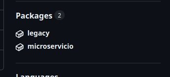

Para levantar los containers con docker compose se ejecuta:

```sh
cd initdb # se va a la carpeta con docker-compose 
make buld
```

Para levantar con manifests k8s:
```sh
cd kubernetes # se va a la carpeta con manifests
make build
```
para realizar limpieza despues del setup, se puede usar:

```sh
make clean
```

Adicionalmente dentro de cada microservicio-app y legacy-app, hay Makefiles para hacer build, teardown, run de manera sencilla.


La validacion de pipelines de github actions se puede revisar en las imagenes:

legacy image:


todos los jobs:


Muestra de imagenes en github container registry:



Declaro que esta entrega fue realizada de forma individual, sin asistencia externa, sin herramientas de generacion automatica, y cimpliendo con todas las reglas del examen.
