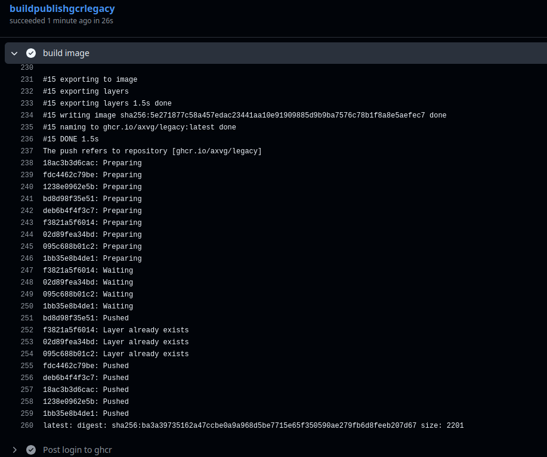
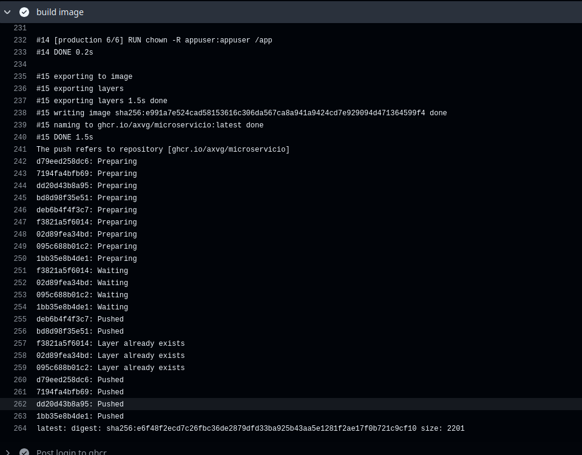
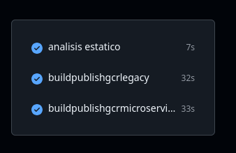

Para levantar los containers con docker compose se ejecuta:

```sh

```

Para levantar con manifests k8s:
```sh

```


La validacion de pipelines de github actions se puede revisar en las imagenes:

legacy image:





todos los jobs:



Declaro que esta entrega fue realizada de forma individual, sin asistencia externa, sin herramientas de generacion automatica, y cimpliendo con todas las reglas del examen.
